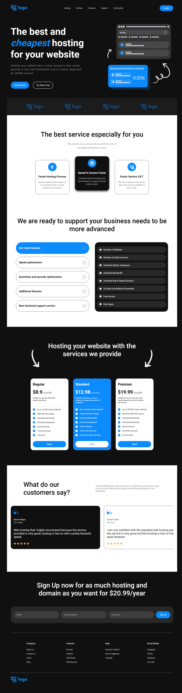

# hosting-site-landing-page

### Tech Stack:

CSS properties like **Flexbox**, **Grid**, **Position** are used here for layouting.
**Media Queries** are used to make the website responsive.
`transition` property is also used to create some animations.

### :rocket: [Live Link](https://guru-404.github.io/hostingsite-webpage/)

### Output

**[Desktop Preview]**

